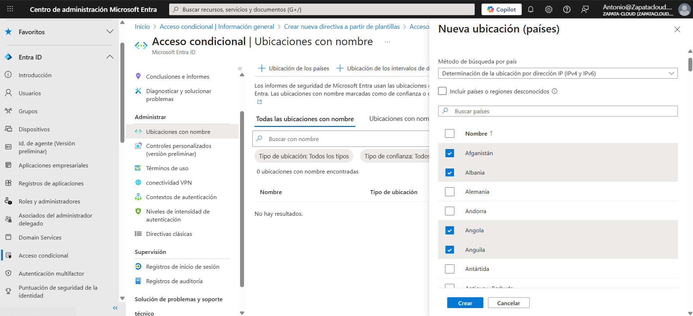
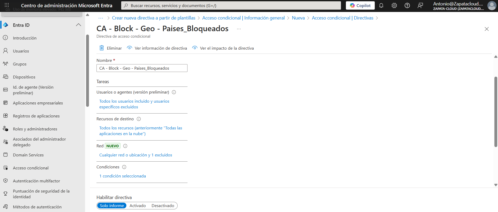
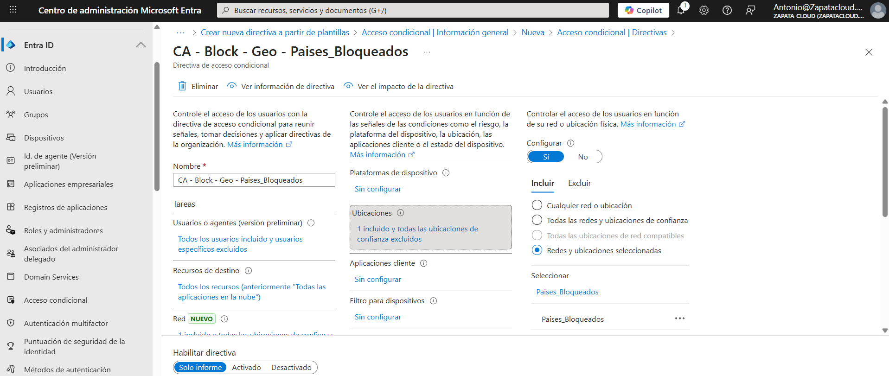
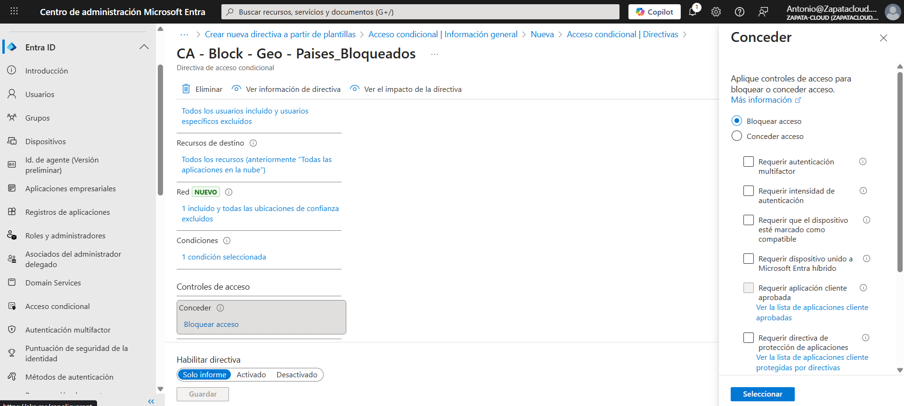
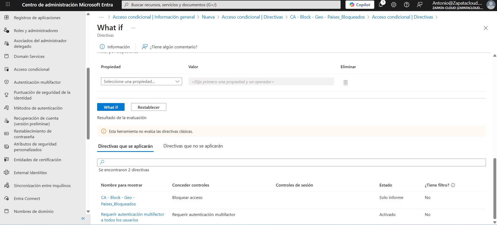
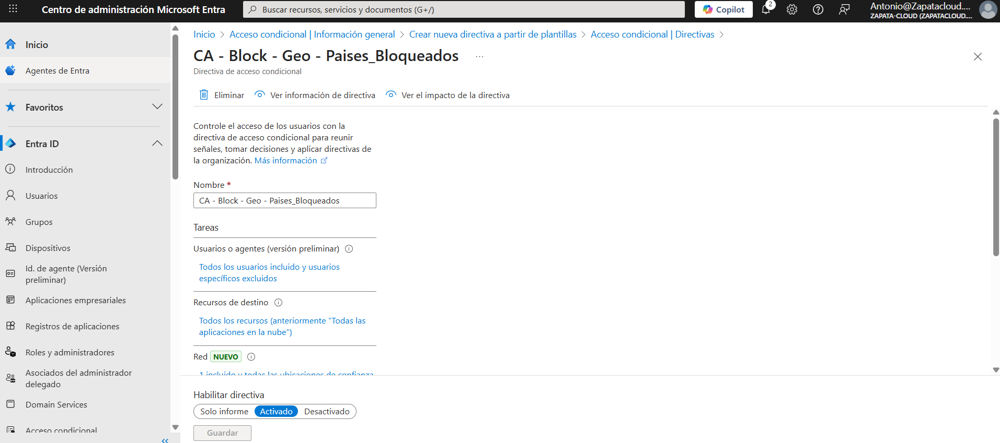

# 🧪Lab 05: Protección Geográfica con Acceso Condicional

## 🎯 Objetivo
Bloquear inicios de sesión desde regiones donde la empresa no opera mediante Acceso Condicional (CA), validando el impacto con **Solo informe** y confirmando el bloqueo real mediante **Sign-in logs**.

## 🛠️ Tareas realizadas
1. Creación de una ubicación con nombre (Named location) para países bloqueados.
2. Creación de directiva CA:
   - Usuarios: **Todos** (excluyendo cuenta **break-glass**)
   - Recursos: **Todos los recursos** (antes “Todas las aplicaciones en la nube”)
   - Condición: **Ubicación** → include `Paises_Bloqueados`
   - Conceder: **Bloquear acceso**
3. Validación en **Solo informe** con **What If**.
4. Activación de la directiva (**Activado**).
5. Verificación con **Sign-in logs** (bloqueo real por CA).

## 📸 Evidencias

### 01 - Named locations (Paises_Bloqueados)

### 02 - CA Policy (Solo informe / Report-only)

### 02B - CA Location (Include Paises_Bloqueados)

### 02C - CA Grant (Block Access)

### 03 - What If (bloqueo evaluado)

### 04 - CA Policy (On)

### 05 - Sign-in logs (bloqueo real por CA)

## ✅ Checklist de verificación
- [x] `Paises_Bloqueados` creado (Named locations)
- [x] Directiva CA creada (All users, excluye break-glass)
- [x] Recursos: **Todos los recursos**
- [x] Ubicaciones: **Include** `Paises_Bloqueados`
- [x] Conceder: **Bloquear acceso**
- [x] Validación con **What If** (Solo informe)
- [x] Directiva activada (**On**)
- [x] Bloqueo real confirmado en **Sign-in logs**

## 🗣️ Qué le diría al cliente / entrevista
“Primero despliego el bloqueo geográfico en **Solo informe** para validar impacto sin cortar servicio. Verifico con **What If** que la directiva bloquearía el acceso desde los países definidos, y luego la activo en **On** excluyendo una cuenta **break-glass**. Finalmente, confirmo el comportamiento y la trazabilidad en **Sign-in logs**, donde se registra el bloqueo por Acceso Condicional.”
